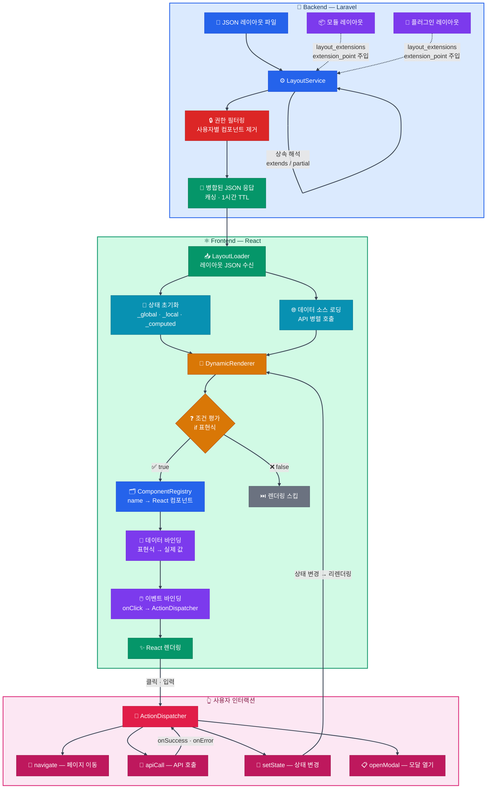

<p align="center">
  
</p>

<p align="center">
  <strong>모던 아키텍처로 다시 태어난 대한민국 대표 오픈소스 CMS</strong><br>
  A modern, extensible CMS platform built with Laravel + React
</p>

<p align="center">
  <a href="#"></a>
  <a href="#"></a>
  <a href="#"></a>
  <a href="#"></a>
  <a href="LICENSE"></a>
  <a href="#"></a>
</p>

---

[소개](#그누보드7-소개) · [주요 기능](#주요-기능) · [기술 스택](#기술-스택) · [아키텍처](#아키텍처) · [빠른 시작](#빠른-시작) · [기본 제공 확장](#기본-제공-확장) · [비즈니스 모델](#비즈니스-모델) · [기존 사용자](#기존-그누보드-사용자) · [문서](#문서) · [기여하기](#기여하기) · [만든 사람들](#만든-사람들) · [커뮤니티](#커뮤니티) · [변경 기록](#변경-기록) · [라이선스](#라이선스)

---

## 그누보드7 소개

**그누보드7 (Gnuboard7)** 은 23년간 대한민국에서 가장 널리 사용된 오픈소스 CMS인 그누보드를, 현대적 기술 스택으로 **완전히 새로 설계**한 차세대 웹 플랫폼입니다.

Laravel과 React를 기반으로, 보안부터 아키텍처까지 처음부터 다시 만들었습니다.

- **JSON 레이아웃 엔진**: React를 몰라도 JSON만으로 React 기반 UI를 선언적으로 정의. 모듈/플러그인이 프론트엔드 빌드 없이 JSON만으로 UI를 동적으로 주입/확장. 고도화된 UI가 필요한 경우 커스텀 React 컴포넌트를 개발하여 등록 가능
- **하나의 플랫폼, 다양한 비즈니스**: 커뮤니티, 쇼핑몰, 구독, 예약 — 비즈니스 모델에 맞게 확장
- **정교한 권한 관리**: 역할(Role) + 권한(Permission) + 스코프(Scope) 3단계 접근 제어로, 서비스 규모가 커져도 통제력 유지
- **글로벌 레디**: 다국어(i18n) 네이티브 지원, 로케일 기반 UI, 다중 통화 대응
- **확장 시스템**: 모듈 + 플러그인 + 템플릿 3중 구조로 코어 수정 없이 기능 확장

---

## 주요 기능

현대적인 웹 플랫폼에 필요한 핵심 기능을 갖추었습니다.

| 영역 | 설명 |
|------|------|
| **모듈 아키텍처** | 모듈 + 플러그인 + 템플릿 3중 확장 구조. 코어 수정 없이 독립적 모듈(게시판, 커머스 등) 개발이 가능합니다. Hook 기반 기능 주입으로 Service-Repository 패턴의 명확한 계층 분리를 유지합니다 |
| **언어팩 시스템** | 새 언어를 코어 수정 없이 ZIP 또는 GitHub URL 로 설치할 수 있습니다. 일본어 등 공식 번들 언어팩을 즉시 사용할 수 있고, 운영자가 직접 수정한 라벨은 언어팩이 덮어쓰지 않도록 sub-key 단위로 보존합니다. 모듈/플러그인/템플릿 단위로 별도 적용 가능 |
| **현지화** | 백엔드부터 프론트엔드까지 일관된 다국어 개발 환경을 제공합니다. 활성 언어팩이 알림 채널 라벨, Provider/Registry 페이로드, 환경설정 카탈로그(결제수단·통화·배송 가능 국가)까지 자동 보강되며, 모듈/플러그인이 자기 도메인 라벨을 자기 영역에서 자기설명하도록 활동 로그·메시지 영역도 분리되어 있습니다 |
| **해외 결제** | 로컬 비즈니스를 넘어 글로벌 커머스로 도약하기 위한 기반을 제공합니다. 결제 연동은 동일한 Extension Point 패턴으로 붙일 수 있으며, 해외 결제 수단은 별도 플러그인으로 제공됩니다 |
| **권한 제어** | 역할별 메뉴와 기능, 데이터 범위까지 제어할 수 있습니다. 역할(Role) + 권한(Permission) + 스코프(Scope) 3단계 접근 제어로 조직 구조에 맞는 유연한 접근 관리를 제공합니다 |
| **본인인증 (IDV)** | 회원가입·비밀번호 재설정·민감 작업 등 모든 본인인증 시점을 라우트/훅 단위 선언형 정책으로 통합 관리합니다. 코어가 메일 프로바이더를 기본 내장하고, 외부 KCP·이니시스·SMS·PortOne·Stripe Identity 등은 동일한 Provider 계약으로 붙일 수 있는 확장점을 제공합니다. 서버가 HTTP 428 응답을 반환하면 프론트엔드 인터셉터가 자동으로 인증 모달을 띄우고 인증 성공 시 원 요청을 재실행합니다 |
| **보안** | 입력값 자동 검증과 토큰 기반 인증을 제공합니다. 설계부터 보안을 고려한 다층 방어 구조(CSRF/XSS/SQL Injection), 로그인 시도 제한·계정 잠금(HTTP 423) 실제 구현, 설치 완료 후 인스톨러 엔드포인트 자동 차단(HTTP 410) 까지 다층 방어를 구성합니다 |
| **유연한 화면 구성** | 화면 구조를 정의하면 즉시 반영할 수 있습니다. 프론트엔드 인프라 없이 JSON 선언만으로 웹앱 수준의 동적 화면 구현이 가능합니다 |
| **레이아웃 편집기** | 위지윅 기반 레이아웃 편집 기능으로 화면 블록을 직접 배치하고 수정 결과를 바로 확인할 수 있습니다 |
| **검증된 기반** | Laravel + React 기반을 제공합니다. 글로벌 기업이 채택한 기술 스택으로 높은 확장성과 유연한 UI 구현이 가능합니다 |
| **공통 캐시 시스템** | `CacheInterface` 와 코어/모듈/플러그인 3종 드라이버로 키 접두사(`g7:core:`, `g7:module.{id}:`, `g7:plugin.{id}:`) 를 자동 격리합니다. 태그 기반 자동 무효화와 `g7_core_settings('cache.*_ttl')` 중앙 관리로 하드코딩 없이 운영할 수 있습니다 |
| **알림 시스템** | 알림 정의(Definition) × 템플릿(Template) × 수신자(Recipients) 3계층 구조로 메일/DB/실시간 브로드캐스트(Reverb) 다채널 독립 발송을 지원합니다. 작성자·역할·특정 사용자·권한 보유자 단위 타겟팅과 훅 기반 발송으로 모듈이 자체 알림을 자유롭게 등록할 수 있습니다 |
| **SEO** | `jaybizzle/crawler-detect` 기반으로 약 1,000종 봇(검색엔진·SNS unfurl·AI 검색)을 자동 감지하여 봇 요청에는 정적 HTML 을, 일반 사용자에게는 SPA 를 응답합니다. OG/Twitter 카드 메타와 모듈이 선언한 도메인 스키마(Article/Product/Offer/AggregateRating), Sitemap 자동·수동 생성, Generator 메타 태그까지 표준 SEO 표면을 코어에서 제공합니다 |
| **활동 로그** | 관리자·사용자 활동 이력을 자동으로 기록하고 조회할 수 있습니다. Monolog 기반 구조로 확장이 용이하며, 액션 라벨이 모듈/플러그인 자체 다국어 파일에서 우선 해석되어 도메인별 자기설명이 가능합니다 |
| **검색** | Laravel Scout 기반 전문 검색을 지원합니다. 상품, 게시글 등 주요 콘텐츠를 대상으로 검색 기능을 제공합니다 |

---

## 기술 스택

| 구분 | 기술 |
|------|------|
| **백엔드** | PHP 8.2+, Laravel 12.x, MySQL 8.0+, Redis 6.0+ |
| **프론트엔드** | React 19, Vite, Tailwind CSS 4 (다크 모드 지원) |
| **인증** | Laravel Sanctum (Bearer 토큰) |
| **테스트** | PHPUnit 11.x, Vitest |
| **코드 품질** | Laravel Pint (PSR-12) |

---

## 아키텍처

```
Gnuboard7
├── Core (Laravel 12)
│   ├── Controller → FormRequest → Service → Repository → Model
│   ├── Hook System (Action / Filter)
│   ├── Permission (Role → Permission → Scope)
│   ├── Identity Verification (Policy × Purpose × Provider × Message)
│   ├── Language Pack (가상 보호 행 + ZIP/GitHub 설치 + sub-key 보존)
│   ├── Notification (Definition × Template × Recipients)
│   └── SEO (Bot Detection → Static HTML → Cache → Sitemap)
│
├── Extensions
│   ├── Modules    — 게시판, 쇼핑몰, 페이지 ...
│   ├── Plugins    — 결제, 인증, 마케팅 ...
│   ├── Templates  — 관리자 UI, 사용자 UI
│   └── LanguagePacks — 일본어 등 공식/외부 언어팩
│
└── Template Engine
    ├── JSON Layout → React Components
    └── Dynamic Rendering + Data Binding
```

### 템플릿 엔진 동작 흐름

그누보드7의 템플릿 엔진은 **JSON으로 UI 구조를 선언**하면, 엔진이 이를 해석하여 React 컴포넌트로 렌더링합니다.

#### 제공 기능

- JSON 선언만으로 React 기반 UI 구성 — React 전문 지식 없이도 화면 개발 가능
- 모듈/플러그인이 프론트엔드 빌드 없이 JSON만으로 UI를 동적으로 주입/확장
- 고도화된 UI가 필요한 경우 커스텀 React 컴포넌트를 개발하여 등록 가능
- UI가 코드가 아닌 데이터(JSON)로 정의되는 구조를 활용한 **위지윅 레이아웃 편집기** — 비개발자도 화면 블록을 직접 배치·편집하고 결과를 바로 확인할 수 있습니다



**JSON 레이아웃 예시** — 아래 JSON이 실제 React UI로 렌더링됩니다:

```json
{
  "data_sources": [
    { "id": "products", "endpoint": "/api/products", "method": "GET" }
  ],
  "layout": {
    "type": "basic", "name": "Div",
    "children": [
      { "type": "basic", "name": "H1", "text": "$t:product_list" },
      {
        "type": "basic", "name": "Div",
        "iteration": { "source": "{{products?.data?.data}}", "item_var": "$item" },
        "children": [
          { "type": "basic", "name": "Span", "text": "{{$item.name}}" }
        ]
      },
      {
        "type": "basic", "name": "Button", "text": "$t:add",
        "if": "{{products?.data?.abilities?.can_create}}",
        "actions": [{
          "event": "onClick",
          "handler": "navigate",
          "params": { "path": "/products/create" }
        }]
      }
    ]
  }
}
```

모듈/플러그인을 활성화하면 해당 UI와 컴포넌트가 자동으로 주입됩니다.
개발자는 JSON만으로 UI를 추가하거나 변경할 수 있어 별도의 프론트엔드 빌드가 필요 없으며, 권한(abilities)에 따라 UI 요소가 자동으로 표시/숨김 처리됩니다.

### 핵심 시스템

플랫폼을 떠받치는 네 가지 시스템이 유기적으로 동작합니다.

#### 1. 확장 시스템 — 3원칙

1. **코어 수정 최소화** — 모든 비즈니스 로직은 모듈/플러그인으로 구현
2. **동적 로딩** — `composer.json` 하드코딩 없이 디렉토리 스캔으로 자동 발견
3. **Hook 기반 확장** — 서비스 계층에서 Action/Filter 훅으로 기능 주입

#### 2. 훅 시스템 (Action / Filter)

Laravel 이벤트와 별개로 동작하는 가벼운 훅 시스템입니다. Action 은 부수 작업(로깅, 알림), Filter 는 값 변형 (기본값 주입, 권한 확장)에 사용됩니다.

```php
// Service 계층에서 훅 발행
HookManager::doAction('core.user.after_create', $user, $data);
$data = HookManager::applyFilters('core.user.filter_create_data', $data);

// 모듈 Listener 가 훅 구독 (자동 발견)
public static function getSubscribedHooks(): array
{
    return [
        'core.user.after_create' => ['method' => 'onUserCreated', 'priority' => 20],
    ];
}
```

모듈/플러그인은 `Listeners/` 디렉토리에 클래스만 두면 `HookListenerRegistrar` 가 자동으로 구독합니다. 큐 직렬화를 통한 비동기 실행도 지원하며, 워커에서도 `Auth::user()`, `request()->ip()`, `App::getLocale()` 같은 컨텍스트가 자동 복원됩니다.

#### 3. 공통 캐시 시스템

`CacheInterface` 를 기반으로 **코어 · 모듈 · 플러그인** 이 키 충돌 없이 각자의 캐시를 관리합니다.

| 드라이버 | 접두사 | 용도 |
| --- | --- | --- |
| `CoreCacheDriver` | `g7:core:{key}` | 코어 서비스 (레이아웃, SEO, 알림, 설정 등) |
| `ModuleCacheDriver` | `g7:module.{identifier}:{key}` | 모듈별 격리 캐시 (게시판 상품 리스트, 쿨다운 등) |
| `PluginCacheDriver` | `g7:plugin.{identifier}:{key}` | 플러그인별 격리 캐시 |

```php
// 모듈 서비스는 BaseModuleServiceProvider::$cacheServices 배열에 등록하면
// 생성자 타입힌트만으로 자동 주입됨 (Storage 패턴과 동일)
public function __construct(
    private BoardRepositoryInterface $repository,
    private CacheInterface $cache, // ← g7:module.sirsoft-board: 접두사 자동 적용
) {}
```

- **TTL 중앙 관리** — 모든 캐시 TTL 은 `g7_core_settings('cache.*_ttl')` 를 추종합니다. 하드코딩 금지
- **자동 무효화** — `CacheInvalidatable` 트레이트를 모델에 적용하면 `saved` / `deleted` 시점에 태그 기반으로 관련 캐시 자동 삭제
- **라이프사이클 연동** — 모듈 비활성화/삭제 시 `ModuleManager` 가 해당 모듈의 격리 캐시를 일괄 flush
- **프론트엔드 캐시 버스팅** — `ext.cache_version` 증가가 응답의 `config.json` 을 통해 전파되어 `?v=` 쿼리 파라미터 기반으로 브라우저 캐시까지 무효화

#### 4. 알림 시스템

**Definition × Template × Recipients** 3계층 모델로 멀티 채널 알림을 관리합니다.

```text
┌─────────────────────┐      ┌───────────────────────┐      ┌─────────────────────┐
│ NotificationDefini- │ 1..N │ NotificationTemplate  │      │ Recipients (JSON)   │
│ tion                ├──────┤ (채널별 독립)         ├──────┤ - trigger_user      │
│ type=order.created  │      │ channel=mail|db|...   │      │ - related_user      │
│ variables=[...]     │      │ subject, body,        │      │ - role              │
│                     │      │ click_url             │      │ - specific_users    │
└─────────────────────┘      └───────────────────────┘      └─────────────────────┘
```

- **Definition** — 알림 종류(`type`), 지원 채널, 변수 메타데이터 정의
- **Template** — 채널(`mail` / `database` / `broadcast`)마다 독립된 제목·본문·클릭 URL. 관리자가 다국어로 커스터마이징 가능
- **Recipients** — 템플릿별로 수신자 규칙을 JSON 으로 정의. 템플릿 단위 독립이므로 "메일은 주문자에게, DB 알림은 역할 보유자에게" 같은 분기 구성 가능

```php
// 모듈 Service 에서 훅 발행만 하면 발송 파이프라인이 자동 실행
HookManager::doAction('sirsoft-ecommerce.order.after_confirm', $order);

// ↓ NotificationHookListener → NotificationDispatcher:
// 1. order.confirmed 정의 조회
// 2. 활성 템플릿 순회 (mail/database)
// 3. 템플릿의 recipients JSON 해석 → 수신자 Collection
// 4. 각 수신자에게 channel 별 발송 (GenericNotification)
// 5. notification_logs 에 발송 이력 기록
```

- 코어 기본 알림 3종: `welcome`, `reset_password`, `password_changed`
- 이커머스 모듈 알림 7종: `order_confirmed`, `order_shipped`, `order_completed`, `order_cancelled`, `new_order_admin`, `inquiry_received`, `inquiry_replied`
- 실시간 브로드캐스트는 Laravel Reverb (WebSocket) 기반. Reverb 미구성 환경에서는 graceful skip 으로 오류 없이 동작
- `GenericNotification` 단일 클래스가 모든 알림을 처리 — 신규 알림 타입 추가 시 개별 Notification 클래스 작성 불필요

#### 5. 언어팩 시스템

새 언어를 코어 수정 없이 추가할 수 있는 운영 도구로, 모듈/플러그인/템플릿 관리와 동일한 라이프사이클(설치 → 활성화 → 업데이트 → 제거 + 자동 백업/롤백) 을 제공합니다.

| 영역 | 동작 |
| --- | --- |
| 설치 경로 | ZIP 업로드 / GitHub URL / `lang-packs/_bundled` 번들 디렉토리 (코어 업데이트 시 일괄 동기화) |
| 적용 범위 | 코어, 모듈, 플러그인, 템플릿 별도 적용 — 모듈 언어팩은 해당 코어 언어팩이 활성일 때만 활성화 |
| 사용자 수정 보존 | 다국어 JSON 컬럼은 sub-key 단위 (`name.ko` / `name.ja`) 로 user override 기록 — 한 언어 라벨만 수정해도 그 언어만 보존, 신규 언어는 자동 동기화 |
| 활성화 시점 | 활성/비활성 시 영향받는 모듈/플러그인의 entity 시더가 자동 재실행 → 메뉴·권한·역할·매니페스트·알림 라벨 즉시 DB 반영 |
| 가상 보호 행 | 코어/번들 확장에 내장된 한국어/영어는 별도 설치 없이 항상 활성/보호 상태로 노출 (수정/제거 차단) |
| 보안 | 언어 번역 외의 PHP 실행 코드 포함 시 설치 차단 |

공식 일본어(ja) 번들 12종(코어 + 주요 모듈/플러그인/템플릿) 이 즉시 사용 가능하며, 인스톨러 4단계에서 모듈/플러그인/템플릿 선택과 종속된 언어팩 카드가 자동 연동되어 함께 설치할 수 있습니다.

> 상세: [docs/extension/language-packs.md](docs/extension/language-packs.md)

#### 6. 본인인증 (Identity Verification)

회원가입·비밀번호 재설정·민감 작업·결제 직전 등 모든 본인인증 시점을 라우트/훅 단위 선언형 정책으로 통합 관리합니다.

```text
┌────────────────────┐    ┌─────────────────────┐    ┌──────────────────────┐
│ Policy             │    │ Purpose             │    │ Provider             │
│ (강제 시점·실패 모드│    │ (인증 목적·허용 채널│    │ (메일·KCP·이니시스   │
│  ·단계·conditions) │ ◀▶ │  ·source 추적)      │ ◀▶ │  ·SMS·외부 IDV ...)  │
└────────────────────┘    └─────────────────────┘    └──────────────────────┘
            │                                                  │
            └──────────▶ Message Template (정책×목적 매핑) ◀───┘
                                    │
                              GenericNotification
```

- **정책 SSoT** — 정책 enable 토글이 라우트 코드 수정 없이 즉시 적용. 모든 API 라우트가 정책 DB 와 자동 매칭
- **428 인터셉터** — 서버가 HTTP 428 응답을 반환하면 프론트엔드가 자동으로 인증 모달을 띄우고 인증 성공 시 원 요청을 자동 재실행
- **선언형 등록** — 모듈/플러그인은 `module.php::getIdentityPolicies()` / `getIdentityPurposes()` / `getIdentityMessages()` 만 선언하면 활성화/업데이트 시 자동 등록되며 운영자 편집값 보존
- **메시지 템플릿** — 프로바이더와 (목적/정책)별로 다국어 제목/본문을 개별 정의. 정책 → 목적 → 프로바이더 기본값 순서로 fallback
- **외부 Provider 슬롯** — 플러그인이 KCP·PortOne·토스인증·Stripe Identity 등을 G7 표준 Extension Point 패턴으로 자기 SDK UI 를 주입 가능
- **이력 관리** — 관리자 화면에서 인증 수단 탭, 통합 검색, 상태/목적/채널/IP 멀티 필터, 보관주기(180일) 일괄 파기 제공

> 상세: [docs/backend/identity-policies.md](docs/backend/identity-policies.md), [docs/backend/identity-providers.md](docs/backend/identity-providers.md), [docs/backend/identity-messages.md](docs/backend/identity-messages.md)

---

## 빠른 시작

### 시스템 요구사항

- PHP 8.2+ (필수 확장 30개 포함)
- MySQL 8.0+ 또는 MariaDB 10.3+ (utf8mb4)
- Node.js 20+ (빌드 시에만 필요)
- Composer 2.x

### 설치

```bash
# 1. 프로젝트 클론
git clone https://github.com/gnuboard/g7.git
cd g7

# 2. 환경 설정 파일 복사
cp .env.example .env

# 3. 브라우저에서 /install 접속 → 설치 마법사 진행
```

> 상세 설치 가이드는 [INSTALL.md](INSTALL.md)를 참조하세요.

---

## 기본 제공 확장

### 모듈

| 모듈 | 설명 |
|------|------|
| **sirsoft-board** | 게시판 — 다중 게시판, 댓글, 파일 첨부 |
| **sirsoft-ecommerce** | 쇼핑몰 — 상품, 주문, 결제, 배송, 쿠폰, 상품 문의 |
| **sirsoft-page** | 페이지 — 정적 콘텐츠 관리 |

### 플러그인

| 플러그인 | 설명 |
|---------|------|
| **sirsoft-pay_kginicis** | KG이니시스 결제 연동 |
| **sirsoft-verification_kginicis** | KG이니시스 본인인증 |
| **sirsoft-daum_postcode** | 다음 우편번호 검색 |
| **sirsoft-marketing** | 마케팅 도구 |
| **sirsoft-ckeditor5** | CKEditor 5 에디터 |
| **sirsoft-gdpr** | 개인정보 보호(GDPR) |

### 템플릿

| 템플릿 | 설명 |
|--------|------|
| **sirsoft-admin_basic** | 관리자 기본 템플릿 |
| **sirsoft-basic** | 사용자 기본 템플릿 |

### 번들 언어팩

설치 시 함께 동반 설치할 수 있는 공식 언어팩입니다. 코어 + 주요 모듈/플러그인/템플릿이 일관된 번역으로 즉시 사용 가능합니다.

| 식별자 | 설명 |
| ------ | ---- |
| **g7-core-ja** | 코어 일본어 |
| **g7-module-sirsoft-board-ja** | 게시판 모듈 일본어 |
| **g7-module-sirsoft-ecommerce-ja** | 이커머스 모듈 일본어 |
| **g7-module-sirsoft-page-ja** | 페이지 모듈 일본어 |
| **g7-plugin-sirsoft-ckeditor5-ja** | CKEditor5 플러그인 일본어 |
| **g7-plugin-sirsoft-daum_postcode-ja** | 다음 우편번호 플러그인 일본어 |
| **g7-plugin-sirsoft-gdpr-ja** | 개인정보 보호(GDPR) 플러그인 일본어 |
| **g7-plugin-sirsoft-marketing-ja** | 마케팅 플러그인 일본어 |
| **g7-plugin-sirsoft-pay_kginicis-ja** | KG이니시스 결제 플러그인 일본어 |
| **g7-plugin-sirsoft-verification_kginicis-ja** | KG이니시스 본인인증 플러그인 일본어 |
| **g7-template-sirsoft-admin_basic-ja** | 관리자 기본 템플릿 일본어 |
| **g7-template-sirsoft-basic-ja** | 사용자 기본 템플릿 일본어 |

> 한국어/영어는 코어/번들 확장에 내장되어 있으며 설치 없이 항상 활성 상태로 동작합니다. 새 언어는 ZIP 또는 GitHub URL 로 자유롭게 추가할 수 있습니다.

### 학습용 샘플 확장

확장 시스템 학습을 위한 최소 구현 샘플입니다. 관리자 UI 에서 "숨김 포함" 토글로 노출되며 CLI 에서는 항상 보입니다.

| 식별자 | 종류 | 설명 |
| ------ | ---- | ---- |
| **gnuboard7-hello_module** | 모듈 | Memo CRUD + 훅 발행 시연 |
| **gnuboard7-hello_plugin** | 플러그인 | Action/Filter 훅 구독 시연 |
| **gnuboard7-hello_admin_template** | Admin 템플릿 | Basic 컴포넌트 최소 셋 |
| **gnuboard7-hello_user_template** | User 템플릿 | 홈 + Memo 리스트 연동 |

---

## 비즈니스 모델

그누보드7 하나로 다양한 비즈니스를 운영할 수 있습니다.

| 모델 | 설명 | 상태 |
|------|------|------|
| **커뮤니티** | 게시판, 댓글, 회원 관리 | 정식 |
| **커머스** | 상품 등록, 주문, 결제, 배송 관리 | 정식 |

---

## 기존 그누보드 사용자

기존 그누보드5에서 그누보드7으로 전환할 수 있도록, 회원·게시글·상품 등 주요 데이터의 **마이그레이션 툴을 제공할 예정**입니다.

---

## 문서

| 문서 | 링크 |
|------|------|
| 설치 가이드 | [INSTALL.md](INSTALL.md) |
| 전체 문서 | [docs/README.md](docs/README.md) |
| 시스템 요구사항 | [docs/requirements.md](docs/requirements.md) |
| 백엔드 개발 | [docs/backend/README.md](docs/backend/README.md) |
| 프론트엔드 개발 | [docs/frontend/README.md](docs/frontend/README.md) |
| 데이터베이스 | [docs/database-guide.md](docs/database-guide.md) |
| 확장 시스템 | [docs/extension/README.md](docs/extension/README.md) |
| 모듈 개발 | [docs/extension/module-basics.md](docs/extension/module-basics.md) |
| 플러그인 개발 | [docs/extension/plugin-development.md](docs/extension/plugin-development.md) |
| 템플릿 개발 | [docs/extension/template-basics.md](docs/extension/template-basics.md) |
| 테스트 | [docs/testing-guide.md](docs/testing-guide.md) |
| API 레퍼런스 | 준비 중 |

---

## 기여하기

그누보드7은 오픈소스 프로젝트입니다. 모든 형태의 기여를 환영합니다.

- 버그 리포트 및 기능 제안: [GitHub Issues](https://github.com/gnuboard/g7/issues)
- 코드 스타일: Laravel Pint (PSR-12)
- 테스트: PHPUnit (백엔드) + Vitest (프론트엔드)
- AI 협업: AI 에이전트용 개발 규칙 명세(AGENTS.md)와 MCP 디버깅 도구를 내장하고 있어, AI 도구와 자연스럽게 협업할 수 있습니다

---

## 만든 사람들

**[SIRSOFT](https://sir.kr)** 에서 개발하고 있습니다.

### Core Team

<p>
  <a href="https://github.com/HeuJung"></a>&nbsp;&nbsp;
  <a href="https://github.com/chym1217"></a>&nbsp;&nbsp;
  <a href="https://github.com/thisgun"></a>
</p>

### Contributors

커뮤니티 기여자 목록은 [GitHub Contributors](https://github.com/gnuboard/g7/graphs/contributors)에서 확인할 수 있습니다.

---

## 커뮤니티

| 채널 | 링크 |
|------|------|
| GitHub | [github.com/gnuboard/g7](https://github.com/gnuboard/g7) |
| SIR 커뮤니티 | [sir.kr](https://sir.kr) |
| 문의 | minsup@sir.kr |

---

## 변경 기록

최근 변경된 사항에 대한 자세한 내용은 [CHANGELOG](CHANGELOG.md)를 참고해 주세요.

---

## 보안 취약점

보안 취약점을 발견하셨다면 [SIR 문의게시판](https://sir.kr/boards/co_qa)에 비밀글로 제보해 주세요.

---

## 라이선스

그누보드7은 [MIT 라이선스](LICENSE)에 따라 배포되는 오픈소스 소프트웨어입니다.

Copyright (c) 2026 SIRSOFT

---

<p align="center">
  Made by <a href="https://sir.kr">SIRSOFT</a>
</p>
